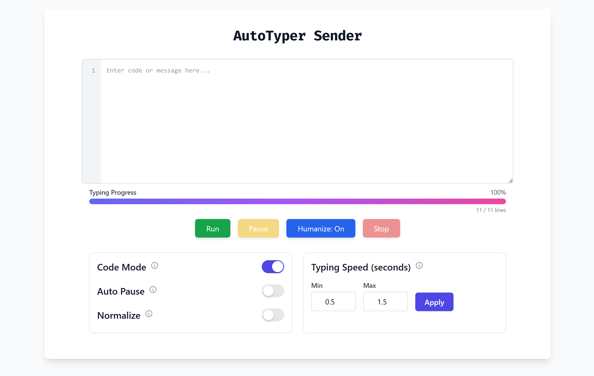

<h1 align="center">⚡ AutoTyper<br><sub>A Typing That Feels Alive</sub></h1>

Human-like, State-aware Auto-typing System built for `live coding`, `tutorial recording`, `technical interviews`, `demos`, `workflow automation`, and `distraction-free automation` - without sounding like a robot.

<p align="center" style="display:flex; gap:10px; flex-wrap: wrap; justify-content:center;">
  <a href="#"></a>
  <a href="#"></a>
  <a href="#"></a>
  <a href="#"></a>
</p>

---


---

> AutoTyper separates **control** from **execution**.  
> A browser-based  `sender` issues commands, while a lightweight `receiver` performs realistic typing directly into any focused application (IDE, editor, browser, terminal).


## 💡 Overview
AutoTyper is an automated typing tool designed to simulate natural typing behavior, useful for testing, automation, or productivity applications. It consists of two main components: the `Sender` (client-side) and the `Receiver` (server-side). The Sender sends messages to the Receiver to simulate typing actions, while the Receiver manages these commands and processes them.

The **Sender** provides a web interface where users can input messages or code, configure typing speed, and control the typing process (start, stop, pause, resume, etc.). The **Receiver** listens for incoming commands from the Sender, processes them, and simulates typing in a terminal or browser environment.

This project is built using **WebSockets** for real-time communication between the Sender and Receiver.

---

## 📁 Repository Structure

```
AutoType/
├── sender_web/
│   ├── app.py
│   └── templates/
│       └── index.html
│
├── static/
│   └── ...
│
├── receiver.py
├── requirements.txt
├── .gitignore
└── README.md
```

## 🚀 Installation & Setup

### 📦 Installation

1. Clone:
    ```bash
    git clone https://github.com/kalpthakkar/AutoTyper.git
    cd AutoTyper
    ```

2. Install Dependencies:
    ```bash
    pip install -r requirements.txt
    ```
    > ⚠️ Receiver requires system input access
    > - On macOS: enable Accessibility permissions
    > - On Linux: run inside X11 session
    > - On Windows: run normally (Admin not required)

### 📥 Receiver Setup

The Receiver script is a Python-based backend that listens for incoming requests and communicates with the Sender using WebSockets.

3. Get your **IPv4 Address**:
    - Open Command Prompt or Terminal on your system.
    - Run `ipconfig` (Windows) or `ifconfig` (Linux/macOS) and note down your **IPv4 Address**.
    - Note this IP address for the Sender.

4. Run the Receiver server:
    ```bash
    python receiver.py
    ```

5. The server should now be running on port `8000`.
    - You should see a message like:
      ```json
      {"status":"ok","service":"AutoType Receiver","ws":"/ws/status"}
      ```
      when opening [localhost:8000](http://localhost:8000).

#### 🌍 WAN Setup (Cloudflare Tunnel) - Optional

To expose the Receiver to the internet, you can use a **Cloudflare Tunnel**:

6. Install `cloudflared`:
    - **Windows:** MSI installer  
    - **macOS:** `brew install cloudflare/cloudflare/cloudflared`  
    - **Linux:** tarball or package manager  
    [Cloudflare Docs](https://developers.cloudflare.com/cloudflare-one/connections/connect-apps/install-and-setup/installation)

7. Authenticate (if needed):
    ```bash
    cloudflared login
    ```

8. Run a tunnel pointing to your local Receiver:
    ```bash
    cloudflared tunnel --url http://localhost:8000
    ```
    - This will generate a public URL like `https://<subdomain>.trycloudflare.com`.

9. Note the generated URL for the Sender setup.

> 💡 For a visual step-by-step guide, check the Cloudflare setup screenshots [here](static/cloudflare-setup).

### 📤 Sender Setup

The Sender is a Python script that connects to the Receiver's WebSocket server. It provides a web interface for sending and controlling typing tasks.

#### LAN

3. Run the Sender with the Receiver's IP address:
    ```bash
    python sender_web/app.py <receiver_url>

    ```

    Replace `<receiver_url>` with the following format, where `<receiver-ip>` is the IP address of the Receiver:
    ```bash
    http://<receiver-ip>:8000
    ```

#### WAN

3. Run the Sender with the public tunnel URL:
    ```bash
    python sender_web/app.py https://<generated-subdomain>.trycloudflare.com
    ```

4. The Sender will run on port `5000`. You can access the control panel at:
    - [http://localhost:5000](http://localhost:5000)  
    - or [http://127.0.0.1:5000](http://127.0.0.1:5000)
    
    

---

## 🌟 Usage

1. Focus any application where typing should occur

2. Paste content into the Sender UI

3. Configure typing options (speed, humanizer, code mode, normalize, etc)

4. Click Run

5. Pause, resume, or stop anytime

AutoTyper types **only into the currently focused window.**

> **💡 Note:** The set speed gets override when `humanize` is `enabled` and only partially contributes to the typing behavior.

---

## ✨ Core Capabilities

### 🧠 Human-Like Typing

```text
• Variable speed per character
• Natural hesitations
• Realistic typos with correction
• Punctuation-aware pauses
```

### 🧾 Code-Aware Execution - Code Mode
```text
• Detects indentation style (tabs vs spaces)
• Syncs indentation with active IDE
• Optional normalization (strip leading whitespace)
• Safe recovery if code mode toggles mid-typing
```

### 🧬 Full Typing State Machine

```text
idle → preparing → typing → paused → completed

• Pause / resume without losing progress
• Auto-pause after each line (teaching mode)
• Safe stop at any time
```

### 🌍 Web-Based Control Panel
```text
• Paste text or code
• Start / pause / resume / stop
• Toggle features live
• Visual progress tracking
• WebSocket-based real-time status updates
```

---

## 🤔 Why AutoTyper Exists

🧨 Traditional auto-typers are:
- too fast,
- too uniform,
- unaware of code structure,
- impossible to control once started.

AutoTyper treats typing as a **stateful, interruptible process**, not a blind key spammer.

**🔦 Insight**  
Typing is *interactive*. Humans pause, hesitate, align indentation, resume, and recover mid-line.

**🔥 Solution**  
AutoTyper introduces:
- **typing state machine**
- **token-aware execution**
- **real-time pause/resume**
- **IDE-safe code alignment**

All controlled remotely - without touching the target machine.

---

## 🪄 Features


- **Real-time Web Interface**: Interact with the Sender via a web interface.
- **Line Tracking**: See percentage completion on control panel.
- **Typing Simulation**: Simulate typing with configurable speed, pauses, and true human-like typing behaviour.
- **Auto Pause**: Automatically pauses typing after each line for more controlled typing.
- **Normalize Whitespace**: Normalize leading spaces/tabs for more predictable typing.
- **WebSocket Communication**: Real-time two-way communication between Sender and Receiver via WebSockets.
- **Cross-Platform**: Both Sender and Receiver can run on various platforms (Windows, Linux, macOS).

---

## 🚧 Limitations

⚠️ **Intentional constraints:**
- Types into foreground window only
- No background or headless mode
- Requires screen focus
- Not intended for bulk automation or bots
- AutoTyper is optimized for human-facing interaction, not throughput.

---

## 🍃 Ideal Use Cases

- 🎥 Live coding demos
- 🎓 Teaching & workshops
- 🧑‍💻 Interviews
- 📺 Screen recordings
- ✍️ Writing with presence

---

## 🌱 Future Roadmap

- Per-line speed profiles
- Multi-cursor simulation
- Typing macros / bookmarks
- Scriptable typing sessions
- Recorder → replay mode

---

## 🤝 Contributing

Contributions are welcome - especially in:
- Typing realism
- State machine robustness
- UI polish
- Platform compatibility

Open an issue before large changes.

---

## ❤️ Acknowledgements

- `pyautogui` for cross-platform input control
- `FastAPI` for clean async APIs
- `Tailwind CSS` for UI ergonomics

---

## 📞 Contact

For any inquiries or support, please contact:

- **Kalp Thakkar** - [kalpthakkar2001@gmail.com](mailto:kalpthakkar2001@gmail.com)
- **GitHub**: [kalpthakkar](https://github.com/kalpthakkar)
- **LinkedIn**: [kalpthakkar](https://www.linkedin.com/in/kalpthakkar)

<h3 align="center">⚡ AutoTyper • Typing that feels alive. ⚡</h3>